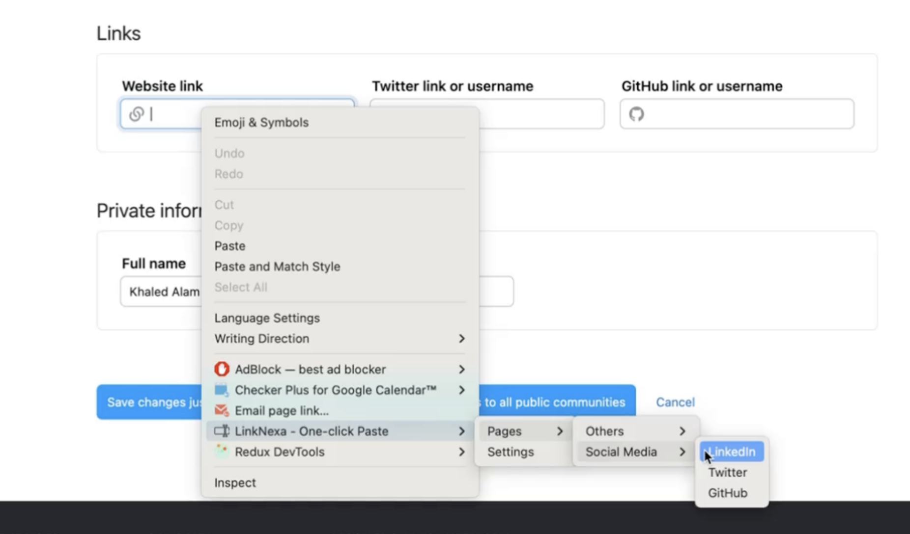
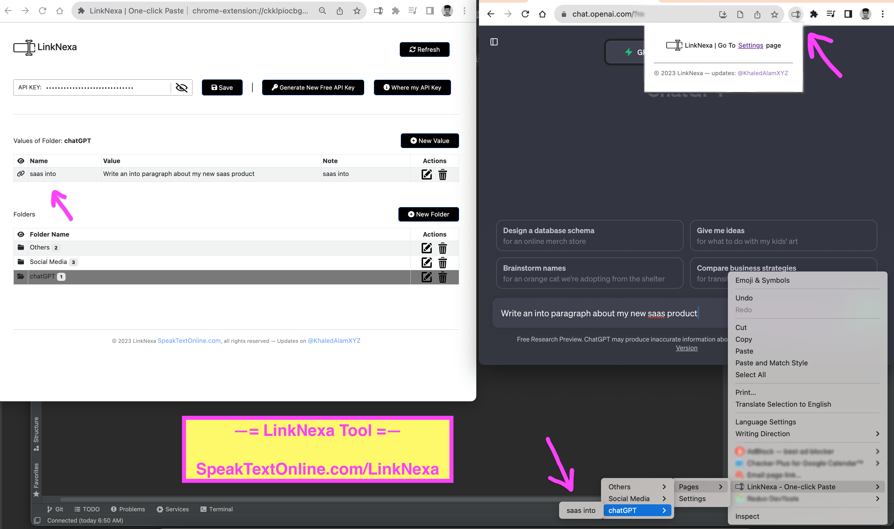

# LinkNexa | One-click Paste Form Inputs

Website: https://speaktextonline.com/LinkNexa

----

Remember the content of forms inputs using one mouse click, Save time and effort to enter the same frequent forms inputs content.

It’s a 1-click Paste Google Chrome Extension that allow you to organize and save your text inputs in an organized menu-submenu(folders-values) structure and paste these saved inputs values quickly using one-click into ANY input field anywhere so that you can remember the contents of the form inputs and restore them at any time.

It’s very convenient to save time and effort to enter the same forms inputs content.

### ⚞ Use LinkNexa To Fill Form Inputs ⚟

Organize and save your forms inputs in an organized menu-submenu and paste with one click.

You can save your social media profiles, your frequent keywords, prefix texts, suffix texts, text inputs, documents links, passwords, clients links, etc.

Instead of using sheets, depending on copy urls from historical browser url section, and any other manual methods. Now you can save a lot of time and effort by saving your links and text inputs in a very good organized menu-submenu structure in dashboard and then use these values whenever and wherever you want with only one-click via right-click mouse context menu.

### ⚞ Use LinkNexa With ChatGPT ⚟

You can use the tool now for FREE, give it a try and let us know your feedback :)
